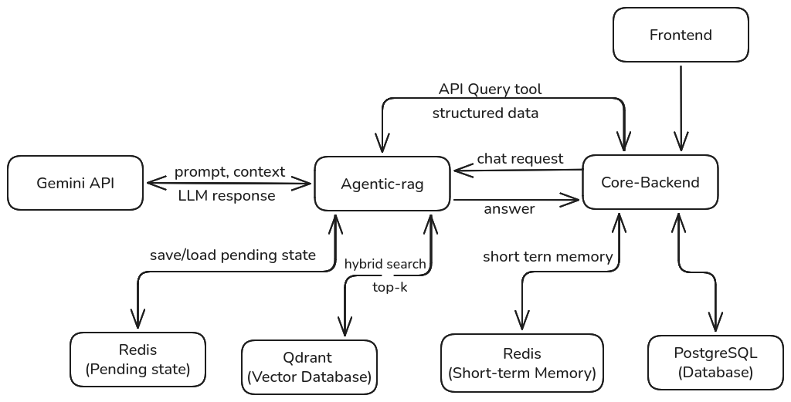
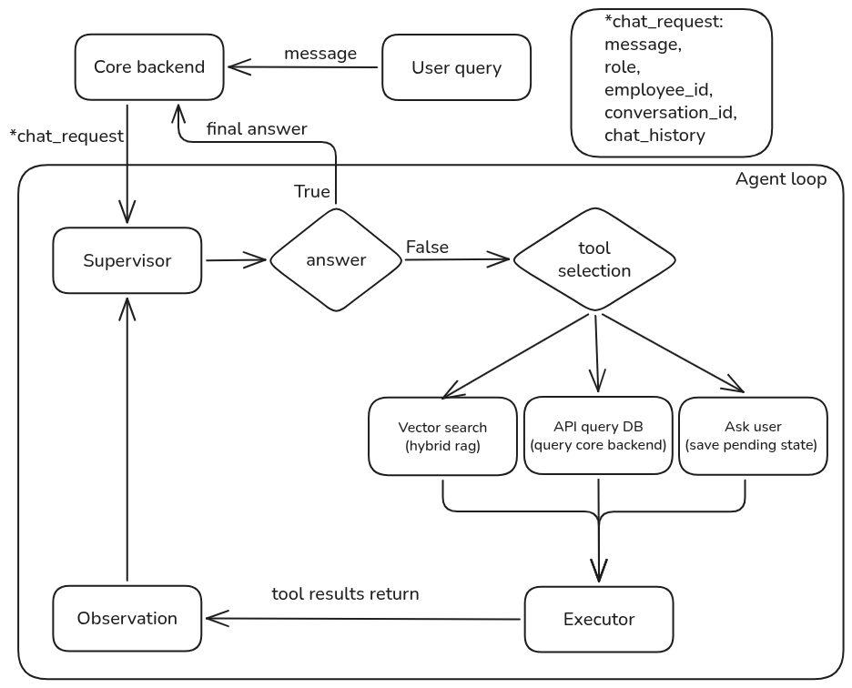
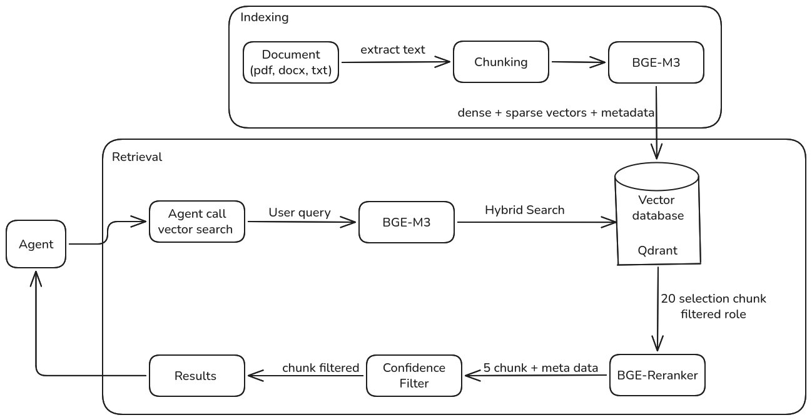

# 🤖 Agentic HR RAG System

[](https://www.python.org/)
[](https://fastapi.tiangolo.com/)
[](https://ai.google.dev/)
[](https://qdrant.tech/)
[](https://redis.io/)
[](https://www.docker.com/)

Agentic HR RAG System là trợ lý AI cho nhân viên và HR: tra cứu chính sách nội bộ, hỏi dữ liệu cá nhân, và làm rõ câu hỏi nhiều lượt bằng ReAct Agent. Hệ thống dùng FastAPI, Gemini API, Qdrant, Redis, PostgreSQL và React/Vite.

## TL;DR

Một hệ thống HR chatbot theo kiến trúc multi-service: Core Backend xác thực JWT và giữ identity, Agentic Service chạy ReAct + RAG để chọn tool phù hợp. Phù hợp cho bài toán HR tiếng Việt cần vừa đọc chính sách, vừa truy vấn dữ liệu nghiệp vụ có phân quyền.

## Features

- ReAct Agent tự chọn tool: `vector_search`, `api_query_db`, `ask_user`.
- RAG tiếng Việt với BGE-M3 dense+sparse, Qdrant hybrid search, RRF và reranking.
- Multi-turn clarification bằng Redis Pending Store khi câu hỏi thiếu thông tin.
- Core Backend xác thực JWT, truyền `employee_id` và `user_role` đã xác thực sang Agentic Service.
- Agentic Service không nhận identity từ prompt người dùng, giảm rủi ro prompt injection.
- API chat thường và streaming SSE cho frontend.

## Table of Contents

- [Demo](#demo)
- [Architecture](#architecture)
- [RAG Pipeline](#rag-pipeline)
- [Evaluation](#evaluation)
- [Engineering Notes / Lessons Learned](#engineering-notes--lessons-learned)
- [Tech Stack](#tech-stack)
- [Project Structure](#project-structure)
- [Getting Started](#getting-started)
- [Roadmap](#roadmap)
- [License / Contributing / Contact](#license--contributing--contact)

## Demo

**Video demo:** https://www.youtube.com/watch?v=RRrTFc2tXjM

<!-- TODO: thêm screenshot dashboard -->

## Architecture

### System Architecture



- **Frontend -> Core Backend (`api-service`)**: client gọi API, Core Backend xác thực JWT và xác định `employee_id`, `role`.
- **Core Backend -> Agentic Service (`agentic-rag`)**: gửi câu hỏi cùng identity đã xác thực; Agentic Service không tự nhận identity từ prompt.
- **Agentic Service -> Gemini API**: chạy ReAct loop (`Thought -> Action -> Observation -> Final Answer`).
- **Agentic Service -> Qdrant**: tìm kiếm chính sách bằng hybrid search và reranking.
- **Agentic Service -> Redis**: lưu pending state khi `ask_user` cần hỏi lại người dùng.
- **Agentic Service -> Core Backend**: truy vấn dữ liệu nghiệp vụ qua API tool; backend vẫn là lớp kiểm soát dữ liệu.
- **Core Backend -> PostgreSQL/Redis**: lưu nghiệp vụ HR, conversation, session/cache/rate-limit.

### ReAct Architecture



- **Thought**: LLM phân tích câu hỏi, lịch sử chat và observation gần nhất.
- **Action**: LLM chọn tool từ registry và sinh `action_input` dạng JSON.
- **Observation**: Executor chạy tool thật, trả kết quả về state.
- **Final Answer**: LLM tổng hợp câu trả lời cuối cùng, kèm citation nếu dùng context.

### Tool Registry

| Tool | Input chính | Output | Dùng khi |
|---|---|---|---|
| `vector_search` | `{ "query": "..." }` | `ToolResult` gồm observation, citations, `used_context`, `low_confidence` | Tra cứu chính sách, nội quy, quy trình đã index trong Qdrant. |
| `api query db` | `{role, employee_id}` | Tra cứu dữ liệu trong database|
| `ask_user` | `question`, `options`, `allow_free_text` | Signal `__ASK_USER__{...}` để lưu pending state | Câu hỏi thiếu mốc thời gian, loại phép, hoặc điều kiện cần làm rõ. |

> Ghi chú: README cũ gọi chung nhóm tool nghiệp vụ là `api_query_database`; trong code hiện tại nhóm này được tách thành `employee_query`, `shift_query`, `attendance_query`.

### Multi-turn Clarification

- `ask_user` trả về payload hỏi lại người dùng, không cố đoán.
- Supervisor dừng vòng ReAct, lưu `AgentState` vào Redis Pending Store.
- Khi người dùng trả lời, Agentic Service resume state cũ và tiếp tục loop.

## RAG Pipeline



- **1. Indexing**: tài liệu HR/pháp lý được chunk theo cấu trúc Điều/Khoản; BGE-M3 tạo dense vector + sparse vector; metadata có `allowed_roles`.
- **2. Retrieval**: BGE-M3 encode query; Qdrant hybrid search dùng dense+sparse với RRF; filter `allowed_roles` ngay ở query; lấy **20 chunk** ứng viên.
- **3. Reranking**: BGE-Reranker-v2-m3 rerank 20 chunk còn **5 chunk**; confidence filter dùng `RETRIEVAL_SCORE_THRESHOLD` để tránh context yếu.

## Evaluation

Hệ thống được đánh giá hiệu năng dựa trên bộ tiêu chuẩn **RAGAS** (sử dụng Gemini-1.5-Flash làm Judge LLM) kết hợp cùng một số chỉ số tùy chỉnh dành riêng cho Agent (Custom Agent Metrics):

### Bảng chỉ số đánh giá (Evaluation Metrics)

| Chỉ số (Metrics) | Điểm số | Ý nghĩa kỹ thuật |
|---|---|---|
| **Faithfulness** (Độ trung thực) | **0.89** | Đo lường mức độ câu trả lời được suy ra hoàn toàn từ Context được cung cấp (tránh hallucination). |
| **Answer Relevancy** (Độ liên quan) | **0.70** | Đánh giá câu trả lời có trực tiếp giải quyết đúng trọng tâm câu hỏi của người dùng hay không. |
| **Context Precision** (Độ chuẩn xác Context) | **0.95** | Đo lường xem các chunk thực sự liên quan có được Reranker đưa lên các vị trí đầu tiên hay không. |
| **Context Recall** (Độ phủ Context) | **0.93** | Đánh giá tỷ lệ thông tin cần thiết trong tài liệu gốc được truy xuất thành công. |
| **Tool Dispatch Accuracy** (Custom) | **92%** | Tỷ lệ Agent gọi chính xác công cụ nghiệp vụ (`vector_search` vs `api_query_database`). |
| **Clarification Rate** (Custom) | **15%** | Tỷ lệ Agent kích hoạt `ask_user` thành công khi gặp các câu hỏi mơ hồ, thay vì đoán mò. |

## Engineering Notes / Lessons Learned

### Bug: Query Rewriting làm degrade retrieval

Trong quá trình phát triển Agentic Multi-turn, một vấn đề nghiêm trọng xuất hiện ở bước **Query Rewriting**.

- **Vấn đề**: ở các lượt hội thoại tiếp theo, LLM khi gọi `vector_search` thường tự viết lại câu hỏi bằng từ đồng nghĩa hoặc rút gọn ngữ cảnh. Ví dụ: từ *"quy định nghỉ thai sản"* thành *"chế độ sinh đẻ"*. Điều này làm lệch embedding BGE-M3 so với từ khóa pháp lý trong tài liệu gốc, dẫn tới degrade retrieval.
- **Cách fix**: `VectorSearchTool` nhận thêm `original_query` từ request gốc. Khi LLM gọi query đã rewrite, tool chạy retrieval cho cả query rewrite và `original_query`, sau đó chọn kết quả có score tốt nhất.
- **Bài học**: với RAG tiếng Việt/pháp lý, query rewrite không luôn tốt. Giữ lại câu hỏi thô giúp bảo toàn keyword nghiệp vụ và giảm lỗi ở multi-turn.

## Tech Stack

| Layer | Công nghệ | Vai trò |
|---|---|---|
| Core Backend | FastAPI, SQLAlchemy, Alembic, Pydantic v2, Uvicorn | REST API, JWT auth, phân quyền, nghiệp vụ HR, migration. |
| Agentic Service | FastAPI, Gemini API, custom ReAct loop | Reasoning, tool dispatch, final answer, streaming. |
| RAG | Qdrant, BGE-M3, BGE-Reranker-v2-m3, FlagEmbedding | Hybrid retrieval, dense+sparse vectors, reranking. |
| State & Data | PostgreSQL, Redis | Database nghiệp vụ, cache/session, pending agent state. |
| Frontend | React 19, TypeScript, Vite, React Query, Zustand, Axios | Dashboard và chat UI. |
| Infra | Docker Compose, CUDA/NVIDIA Container Toolkit | Chạy local multi-service, GPU cho embedding/reranker. |

## Project Structure

```text
hr_bot/
├── agentic-rag/              # Agentic Service: ReAct + RAG (port 8081)
│   ├── src/
│   │   ├── agents/           # Supervisor, Executor, AgentState, Pending Store
│   │   ├── api/              # Chat/document ingestion routers
│   │   ├── features/         # Chat/document services & schemas
│   │   ├── integrations/     # Gemini, Qdrant, Redis, api-service clients
│   │   ├── rag/              # Ingestion, embeddings, retrieval, reranker
│   │   ├── tools/            # vector_search, api_queries, ask_user
│   │   └── main.py           # FastAPI app
│   ├── Dockerfile
│   └── requirements.txt
├── api-service/              # Core Backend nghiệp vụ (port 8000)
│   ├── alembic/              # Database migrations
│   ├── src/
│   │   ├── api/              # Auth, users, employees, attendance, chat...
│   │   ├── core/             # Settings, DB, Redis, middleware, clients
│   │   └── main.py           # FastAPI app
│   ├── Dockerfile
│   └── requirements.txt
├── web-dashboard/            # React + TypeScript + Vite frontend
│   ├── src/
│   ├── package.json
│   └── vite.config.ts
├── docs/
│   ├── System_Architecture.png
│   ├── ReAct.png
│   └── RAG_Pipeline.png
├── docker-compose.yml
└── README.md
```

## Getting Started

### Prerequisites

- Docker & Docker Compose.
- NVIDIA Container Toolkit nếu muốn chạy embedding/reranker bằng GPU.
- Node.js + npm nếu chạy frontend local.
- Gemini API key cho `agentic-rag`.

### Installation

**Bước 1: Cấu hình biến môi trường**

```bash
cp api-service/.env.example api-service/.env

# agentic-rag/.env.example hiện chưa có trong repo.
# Tạo agentic-rag/.env theo bảng biến môi trường ở trên.
```

Đảm bảo `RAG_API_KEY` giống nhau ở `api-service/.env` và `agentic-rag/.env`.

**Bước 2: Khởi động backend qua Docker Compose**

```bash
docker compose up -d --build
```

Lệnh này chạy PostgreSQL, Redis, Qdrant, `api-service` và `agentic-rag`.

**Bước 3: Khởi chạy frontend**

```bash
cd web-dashboard
npm install
npm run dev
```

Frontend mặc định chạy ở URL Vite in ra terminal, thường là `http://localhost:5173`.

### Try the API

Luồng public nên đi qua Core Backend vì JWT ở đây xác định identity. Agentic Service là internal service và được bảo vệ bằng `X-API-Key`.

**1. Login**

```bash
curl -s -X POST http://localhost:8000/api/v1/auth/login \
  -H "Content-Type: application/json" \
  -d '{
    "email": "admin@example.com",
    "password": "Admin12345"
  }'
```

Response rút gọn:

```json
{
  "access_token": "<JWT>",
  "refresh_token": "<REFRESH_TOKEN>",
  "token_type": "bearer"
}
```

**2. Tạo conversation**

```bash
curl -s -X POST http://localhost:8000/api/v1/chat/ \
  -H "Authorization: Bearer <JWT>" \
  -H "Content-Type: application/json" \
  -d '{"title": "Hỏi chính sách nghỉ phép"}'
```

Response rút gọn:

```json
{
  "id": "<conversation_id>",
  "employee_id": "<employee_id>",
  "title": "Hỏi chính sách nghỉ phép"
}
```

**3. Gửi message**

```bash
curl -s -X POST http://localhost:8000/api/v1/chat/<conversation_id>/messages \
  -H "Authorization: Bearer <JWT>" \
  -H "Content-Type: application/json" \
  -d '{
    "message": "Quy định nghỉ thai sản như thế nào?"
  }'
```

Response rút gọn:

```json
{
  "answer": "Theo tài liệu ... [1]",
  "citations": [
    {
      "index": 1,
      "filename": "policy.pdf",
      "page": 12,
      "score": 0.82
    }
  ],
  "used_context": true,
  "ask_user": false,
  "finish_reason": "answer"
}
```

**Streaming SSE**

```bash
curl -N -X POST http://localhost:8000/api/v1/chat/<conversation_id>/messages/stream \
  -H "Authorization: Bearer <JWT>" \
  -H "Content-Type: application/json" \
  -d '{"message": "Hôm nay tôi làm ca nào?"}'
```

### Ports

| Service | Host port | Container port | Mô tả |
|---|---:|---:|---|
| PostgreSQL | `5433` | `5432` | Database nghiệp vụ. |
| Redis | `6379` | `6379` | Cache, session, pending state. |
| Qdrant HTTP | `6333` | `6333` | Vector database HTTP API. |
| Qdrant gRPC | `6334` | `6334` | Vector database gRPC API. |
| api-service | `8000` | `8000` | Core Backend. |
| agentic-rag | `8081` | `8081` | Agentic Service. |
| web-dashboard | `5173` | N/A | Vite dev server khi chạy local. |

## Roadmap

- [ ] Thêm `agentic-rag/.env.example` đồng bộ với `src/core/settings.py`.
- [ ] Thêm screenshot/GIF dashboard vào README.
- [ ] Chuẩn hóa metrics README với output mới trong `agentic-rag/eval/results/metrics_summary.json`.
- [ ] Thêm CI chạy lint/test/build cho 3 service.

## License / Contributing / Contact

**License:** TBD. Repo hiện chưa có file `LICENSE`.

**Contributing:** issue/PR welcome. Khi thêm feature Agent/RAG, nên kèm test hoặc eval case cho tool dispatch và retrieval.

**Contact:** TODO.
